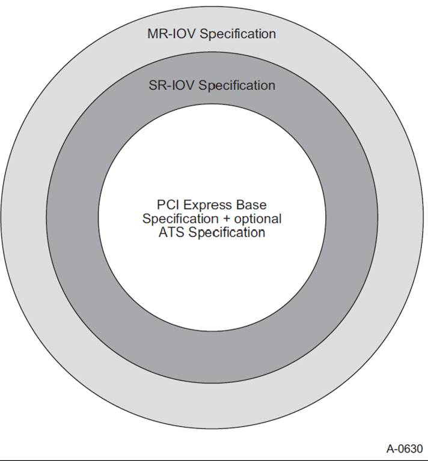

# <a id='9'>9 Single Root I/O Virtualization and Sharing</a>
## <a id='9.1'>9.1 SR-IOV架构概述</a>
工业界付出了巨大代价通过使用虚拟化技术提高硬件使用率（如应用执行）。Single Root I/O Virtualization and Sharing (SR-IOV) 让多个System Images（SI）共享PCI硬件资源。

为了展示这项技术如何被用来提高资源使用效率，参考[图9-1](#pic-9-1)所示的通用平台配置。

*<a id='pic-9-1'>图9-1 通用平台配置</a>*

通用平台配置由一下组件组成：
- PCIe RC，包含：
  - 处理器 - 通用、嵌入式、或专用处理器单元
  - 内存 - 通用或嵌入式
  - RC集成EP（RCiEP）
  - PCIe根端口（RP） - 每个RP代表一个独立的层次结构。每个层次结构都对应一个单一的根层次结构，以区别于MR-IOV中定义的多层次结构技术。
- PCIe Switch - 提供IO扇出和连接
  - PCIe设备 - 多IO设备类型（例如网络存储等）
  - System Image - 像操作系统的软件，用于执行程序或可信服务（例如共享或非共享IO设备驱动）

为了无需改变硬件提高硬件资源使用效率，可以执行多SI。如[图9-2](#pic-9-2)所示，在硬件和SI之间插入了称为Virtualization Intermediary (VI) 的软件。

*<a id='pic-9-2'>图9-2 Generic Platform Configuration with a VI and Multiple SI</a>*

VI完全拥有底层硬件的所有权。VI使用超出本规范范围的多种方法对硬件进行抽象，为每个SI提供其自身的虚拟系统。每个SI可用的实际硬件资源随负载或客户策略变化。虽然这种方法在许多环境工作良好，但IO密集负载面临严重性能下降。VI必须拦截并处理每个IO操作，包括进和出，这回显著增加平台资源开销。

SR-IOV提供了减少这些平台资源开销的工具。SR-IOV的好处有：
- 能够消除VI对主要数据传输操作（DMA、内存空间访问、中断处理等）参与。消除VI对每个IO操作的拦截和处理可以显著提高程序和平台的性能。
- 通过Single Root PCI Manager（SR-PCIM）控制SR-IOV资源配置和管理的标准化方法。
  - 由于存在多种实施方案（例如系统固件，VI，操作系统，IO驱动），SR-PCIM的实现不在本规范的范围内。
- 能够在设备内提供大量IO Function的同时，降低硬件要求和相关成本。
- 能够把SR-IOV与其他IO虚拟化技术（如ATS、ATPT和中断重映射）集成，从而创建强大完整的IO虚拟化解决方案。

[图9-3](#pic-9-3)展示了一个有SR-IOV能力的平台示例。

*<a id='pic-9-3'>图9-3 具有SR-IOV和IOV启用组件的通用平台配置</a>*

SR-IOV通用平台配置由以下额外功能元件组成：

- SR-PCIM - 负责配置SR-IOV capability、管理PF和VF，以及处理相关错误事件和整体设备控制（例如电源管理和热插拔服务）的软件。
- 可选的Translation Agent（TA） - TA是负责把PCIe trans中地址转化为平台物理地址的硬件或软硬件。TA可能包含Address Translation Cache（ATC）以加速访问转换表。TA可能同时支持Address Translation Serviecs（ATS），ATS使得PCIe Function可以获得对相关存储进行DMA访问的先验地址转换。ATS的益处和操作详见[第10章](#10)。
- 可选的Address Translation and Protection Table（ATPT）- ATPT包含一系列TA处理PCIe请求（DMA读，DMA写，或中断请求）需要访问的地址映射。详见[第10章](#10)。
  - PCIe中把中断当作内存写操作。根据requester id和PCIe trans中的地址，可以将中断路由到任何目标（例如，处理器内核），而这对于相关IO Function是透明的。
  - DMA读写请求根据Routing ID和PCIe trans中的地址进行转换。
- 可选的Address Translation Cache（ATC） - 一个ATC在平台中可以存在于两个位置，在RC集成的或其上的TA中，或在PCIe设备中。RC中，ATC能够加速翻译查找。设备中用ATS实现ATC。地址已经翻译的PCIe trans可以绕开平台的ATC以提高性能却没有影响ATPT技术带来的好处。详见[第10章](#10)ATS。
- 可选的Access Control Services（ACS） - ACS在PCIe中定义了一系列点决定一笔TLP是否应该正常被路由，阻止或重定向。支持SR-IOV的系统中ACS可以用于防止分配给VI或不同SI的Function彼此之间或与peer设备通信。重定向可以允许TA决定端对端转发之前翻译上游memory TLP地址。可选的ACS P2P Egress Control可提供选择性阻塞。ACS 需与ATS交互。详见[9.3.7.6节](#9.3.7.6)。
- Physical Function（PF） - PF是支持SR-IOV Extended Capability并且SR-PCIM，VI或SI可访问的PCIe Function。
- Virtual Function（VF） - VF是SI直接可访问的轻量级PCIe Function。
  - 至少，Function的主数据传输相关的资源可供SI访问。配置资源应仅限可信软件组件访问，例如VI或SR-PCIM。
  - VF可被不同的SI串行共享（即，VF可分配给一个SI，重置后分配给另一个SI）。
  - VF可选从一个PF迁移到另一个PF。迁移过程本身不在本规范中，但通过本规范中定义的配置控制来实现。
- 同一PF关联的所有VF必须具有和PF相同的device type（例如，同为网络设备或同为存储设备）。

为了比较PCIe设备和支持PCIe SR-IOV的设备，请查看以下图示。[图9-4](#pic-9-4)展示了一个兼容PCIe的设备示例。

*<a id='pic-9-4'>图9-4 Example Multi-Function Device</a>*

该图展示了一个具有以下特征的multi-Funtion PCIe设备示例：

- PCIe设备共享一条通用PCIe Link。所有Function共享的这个Link和PCIe功能均通过Function 0进行管理。
  - 虽然图中仅实现了三个Function，PCIe设备可以通过使用ARI capability支持最多256个Function。
  - 所有Function均通过PCI枚举过程使用捕获的单个总线编号。
- 在这个例子中，每个PCIe设备支持ATS capability并且都有一个关联的ATC管理ATS获得的翻译地址。
- 每个PCIe Function都有包括独立配置空间和BAR的一系列物理资源。
- 每个PCIe Function都可以被分配给SI。为了防止一个SI受其他SI影响，VI必须拦截并处理所有PCIe配置操作。

正如图中所展示，硬件资源随配置的Function数量而扩展。根据设备的复杂性和规模，每个功能的增量成本有所不同。为了降低硬件增量成本，可以使用SR-IOV构建设备，像[图9-5](#pic-9-5)所示支持单个PF和多个VF。

*<a id='pic-9-5'>图9-5 Example SR-IOV Single PF Capable Device</a>*

[图9-5](#pic-9-5)展示了一个PF多VF的案例。需要注意的关键点：

- PF兼容PCIe。
  - 最初常规复位后，支持本规范中定义的SR-IOV capability的PCIe Function应禁用SR-IOV capability。
  - 为了识别PF支持的page size和相关VF，需要读Supported Page Sizes配置字段。关于如何用该字段在系统页面边界上对齐PF或VF的内存口径，参见[9.2.1.1.1节](#9.2.1.1.1)。
- PF命名法 **PF M**表示Function编号为**M**的PF。
- VF命名法 **VF M,N**表示PF M相关的第N个VF。VF编号从1开始，因此PF M相关的第一个VF是VF M,1。
- 每个VF和PF共享多个常规配置空间。（例如那些通过单个PF控制所有VF的字段，共享这些字段可以减少实现VF所需的硬件资源。）
  - VF使用和PF相同的配置机制和header type。
  - 给定PF相关的所有VF共享一份VF BAR集（见[9.3.3.14节](#9.3.3.14)），共享在SR-IOV Extended capability中的用于控制VF Memory空间访问同一个VF MSE位（见[9.3.3.3.4节](#9.3.3.3.4)）。
  - InitialVFs和TotalVFs字段用于识别一个PF可以关联的VF最大数量。
  - 如果设备不支持VF迁移，InitialVFs和TotalVFs应该包含相同的值。如果设备支持VF迁移，当读到TotalVFs时，PF必须返回可以分配到该PF的VF数量。对这样一个设备，读到InitialVFs时，PF必须返回分配给该PF的初始VF个数。
- 每个Function，PF和VF分配到一个独特的Routing ID。每个PF的Routing ID按照[2.2.4.2节](#2.2.4.2)构建。每个VF的Routing ID由关联的PF和该PF的SR-IOV Extended capability中的字段决定。
- 每次PCIe和SR-IOV配置访问假定通过像VI或SR-PCIM的可信软件组件。
- 每个VF包含一系列提供Function特定服务需要的不共享硬件资源（例如，工作队列、数据缓冲区等资源等）。这些资源可以被SI直接访问而不需要VI或SR-PCIM拦截。
- 每个SI可以分配一个或多个VF。分配策略不在本规范内。
- 虽然此示例展示了PF内的一个ATC，但ATC的存在与否是可选的。此外，本规范并不排除在设备中每个VF支持一个ATC的实现方案。
- 内部路由特定于实现。
- 虽然PF操作存在许多潜在的使用模型，但常见的使用模型是使用PF严格在VI的控制下引导设备或平台。一旦SR-IOV Extended capability配置为允许把VF分配给各自SI，PF更多扮演管理角色。例如，PF可以被用于管理设备特定功能，例如分配给每个VF的内部资源，PCIe Link或Function特定Link（例如网络或存储Link）共享资源的仲裁。这些策略管理和资源分配策略不在本范围规定。

[图9-6](#pic-9-6)展示了另一个使用案例模型。这个案例中，设备支持多个PF有各自一系列VF。

*<a id='pic-9-6'>图9-6 Example SR-IOV Multi-PF Capable Device</a>*

需要注意的关键点：

- 每个PF可以分配零个或多个VF。设备中每个PF的VF不需要相同。
- ARI Extended capability允许Function分配到Function Groups并且定义如何配置Function Group仲裁。PF和VF可以分配到Function Groups并且获得相关仲裁能力的优点。每个Function Froup中仲裁任特定于实现。
- PF和VF之间的内部路由特定于实现。
- 某些使用模型中所有PF可能设备类型相同（例如所有PF提供相同的网络设备或相同的存储设备）。另一些模型，每个PF可能时不同的设备类型（例如，[图9-6](#pic-9-6)中一个PF时网络设备而另一个时加密设备）。
  - 在设备类型之间存在依赖关系的使用模型中，例如，对于每个网络设备类型的VF，每个SI也需要一个加密设备类型的VF。SR-IOV Extended capability提供了一种指示这些依赖关系的方法。构建这些依赖关系以及将依赖的系列VF分配到给定SI的策略不在本规范范围内。

正如前面的例子所见，PF和VF的数量可以分级使用模型需要变化。为了支持多种选择，SR-IOV设备可以支持以下数量和组合的PF和VF：

- 使用ARI capability，设备最多支持256个PF。Function编号分配特定于实并且可以在256的Function编号空间中稀疏分布。
- PF只能与设备捕获的Bus编号相关联，如[图9-7](#pic-9-7)所示。
- SR-IOV设备可以消耗多个Bus编号 - VF可以与任何该设备内的Bus编号范围内的Bus编号相关联。捕获的Bus编号加上软件配置的任何其他Bus编号。详见[9.2.1.2节](#9.2.1.2)。
  - 使用多个Bus编号使得设备支持非常大量的VF - 最多支持Routing ID空间的大小减去用于识别中间Bus的位。
  - 如果软件没有识别有效的额外Bus编号，那么在额外Bus编号上实现的VF可能不可见。

> [!NOTE]
> **Function Co-location**
> 
> ARI Extended capability使得设备最多支持与捕获Bus编号关联的最多256个Function（Function，PF，或VF的任意组合）。如果使用模型不需要超过256个Function，强烈建议将所有Function、PF和VF都放在捕获的总线编号内，而无需额外的Bus编号来访问VF。

*<a id='pic-9-7'>图9-7 Example SR-IOV Device with Multiple Bus Numbers</a>*

如[图9-8](#pic-9-8)，在最后一个示例中，设备实现可以混合任意数量的Function、PF和VF。

*<a id='pic-9-8'>图9-8 Example SR-IOV Device with a Mixture of Function Types</a>*

需要注意的关键点：

- 每个设备必须实现Function 0。Function 0可以是PF（即它可以实现SR-IOV Extended capability）。
- 任何Function组合都可以与捕获的Bus编号关联。
  - 非VF只能与捕获的Bus编号相关联。
- 如果支持ARI Extended capability，可以把Function分配到Function Group。分配策略不在本规范内。如果不支持ARI Extended capability，Function仍然可以使用[6.3.3.4节](#6.3.3.4)中定义的Function仲裁功能。

### <a id='9.1.1'>9.1.1 PCI技术互操作性</a>
明确互操作性要求对于任何技术的成功都至关重要。为此，PCI-SIG IO虚拟化规范旨在最大限度地提高符合规范的实现方案的互操作性潜力。从概念上讲，这可以看作是一组同心圆，它们定义了构建支持IOV的组件需要功能如何分层，如[图 9-9](#pic-9-9)所示。

*<a id='pic-9-9'>图9-9 IO虚拟化互操作性</a>*

需要注意的关键点：

- IO虚拟化扩展的核心在于此规范。所有IOV实现都必须支持[PCIe-1.1](#PCIe-1.1)或更高版本。IOV规范会在适用情况下注明这些版本之间的相关差异。
  - 所有IOV规范不涉及物理层。
  - SR-IOV不涉及本规范中规定的数据链路层或事务层。
  - [MR-IOV]不涉及本规范中规定的事务层。
  - 所有IO虚拟化功能均通过PCIe扩展配置空间中实现的新PCI Express capability进行通信。
  - IO虚拟化规范不影响PCI或PCI-X规范。
  - 一个层次结构可以由PCIe和PCIe转PCI/PCI-X桥混合组成。
    - PCIe转PCI/PCI-X桥和PCI/PCI-X设备可被多个SI串行共享。
- ATS定义了适用于任何Function的可选功能。SR-IOV组件支持ATS。
- 要实现SR-IOV设备，SR-IOV要求该设备完全符合[PCIe](#PCIe)标准。
  - 一个层级结构可以由SR-IOV组件和非SR-IOV组件混合组成。例如，一个层级结构可以包含SR-IOV和非SR-IOV EP设备的任意组合。

## <a id='9.2'>9.2 SR-IOV初始化和资源分配</a>
### <a id='9.2.1'>9.2.1 SR-IOV资源识别</a>
后面的章节描述了软件如何判断设备是否具有SR-IOV功能，并随后通过VF配置空间识别VF资源。
#### <a id='9.2.1.1'>9.2.1.1 配置SR-IOV capabilities</a>
本节描述了激活PF的IOV capabilities之前必须配置的字段。只能通过设置PF中SR-IOV Extended capability中的VF Enable位（见[9.3.3.3.1节](#9.3.3.3.1)）启用VF。

NumVFs字段（见[9.3.3.7节](#9.3.3.7)）定义了相关PF中VF Enable置位时启用VF的数量。

#### <a id='9.2.1.1.1'>9.2.1.1.1 VF BAR配置机制</a>
本节描述了如何配置VF BAR映射内存空间。VF不支持IO空间，因此VF BAR不得指向IO空间。

System Page Size字段（见[9.3.3.13节](#9.3.3.13)）定义了激活PF IOV capabilities时系统映射VF PCIe内存地址所使用的page size。PF用System Page Size把每个VF BAR定义的内存段对齐到系统页边界。System Page Size选择的值必须是SR—IOV Extended capability中Supported Page Size的一个。

VF BAR的行为与普通PCI内存空间BAR的行为相同（见[7.5.1.2.1节](#7.5.1.2.1)），区别在于VF BAR描述每个VF的内存段，而PCI BAR描述单个Function的内存段。如果实现了VF Resizable BAR Extended Capability（见[9.3.7.5节](#9.3.7.5)），则VF BAR中某些位的属性受到影响。

- [7.5.1.2.1节](#7.5.1.2.1)中描述的确定Function BAR内存范围的行为适用于所有VF。就是说，每个VF BAR所需的内存大小可以通过写入全一然后读取VF BAR来确定。读取的结果必须按照[7.5.1.2.1节](#7.5.1.2.1)中的描述进行解释。
- [7.5.1.2.1节](#7.5.1.2.1)也描述了第一个VF相关的每个BAR的起始内存地址的分配行为。就是说，设备使用写入每个VF BAR的地址作为第一个VF的起始地址。
- VF BAR和[7.5.1.2.1节](#7.5.1.2.1)中描述的BAR的区别在于第二个VF以及更高的VF由第一个VF的起始地址和存储空间尺寸导出。任何给定VFv的内存空间的任何已实现BARb根据下面的公式计算：

  BARb VFv起始地址 = VF BARb + (v - 1) x (VF BARb aperture size)

  其中VF BARb aperture size是VF BARb的大小，由[9.3.3.14节](#9.3.3.14)中描述的常规BAR探测算法确定。

  只有VF Enable和VF MSE同时置位，VF内存空间才会启用（见[9.3.3.3.1](#9.3.3.3.1)节和[9.3.3.3.4节](#9.3.3.3.4)）。注意System Page Size（见[9.3.3.13节](#9.3.3.13)）的改变会影响VF BAR aperture size。

[图9-10](#pic-9-10)展示了一个PF和VF内存空间aperture例子。

*<a id='pic-9-10'>图9-10 单BAR设备的BAR空间示例</a>*

#### <a id='9.2.1.2'>9.2.1.2 VF识别</a>
SR-IOV Extended capability中First VF Offset和VF Stride字段是16位Routing ID偏移量。用这些偏移量计算VF的Routing ID受下面的限制：

- PF中NumVFs的值（[9.3.3.7节](#9.3.3.7)）影响该PF中First VF Offset（[9.3.3.9节](#9.3.3.9)）和VF Stride（[9.3.3.10节](#9.3.3.10)）的值。
- 最小编号PF中ARI Capable Hierarchy（[9.3.3.3.5节](#9.3.3.3.5)）的值影响所有设备中PF的First VF Offset和VF Stride的值。
- 当PF的VF Enable清除时，该PF的NumVFs（[9.3.3.3.1节](#9.3.3.3.1)）可能改变。
- 只有设备中所有PF的VF Enable清除时，ARI Capable Hierarchy（[9.3.3.3.5节](#9.3.3.3.5)）才能改变。

> [!NOTE]
> **NumVFs and ARI Capable Hierarchy**
>
> 适当配置NumVFs和ARI Capable Hierarchy后，软件可能读取First VF Offset和VF Stride决定PF的VF占用多少个Bus编号。任何额外的Bus编号直到VF Enable置位才被实际使用。

[表9-1](#tab-9-1)描述了用于决定每个VF相关Routing ID的算法。

*<a id='tab-9-1'>表9-1 VF Routing ID算法</a>*

| VF Number | VF Routing ID |
| -- | -- |
| VF 1 | (PF Routing ID + First VF Offset) Modulo 216 |
| VF 2 | (PF Routing ID + First VF Offset + VF Stride) Modulo 216 |
| VF 3 | (PF Routing ID + First VF Offset + 2 * VF Stride) Modulo 216 |
| ... | ... |
| VF N | (PF Routing ID + First VF Offset + (N-1) * VF Stride) Modulo 216 |
| ... | ... |
| VF NumVFs (last one) | (PF Routing ID + First VF Offset + (NumVFs-1) * VF Stride) Modulo 216 |

此Routing ID计算中使用的所有算术运算均为16位无符号运算舍弃所有进位。

所有VF和PF必须具有明确的Routing ID。在设备任何设置了有效的NumVFs的PF中，任何PF或VF的Routing ID都不得与其他任何PF或VF的Routing ID 重叠。

VF Stride和First VF Offset是常数。除非本节前述已明确，其值不应被设备中本Function或其他Function中的设置影响。

VF可能位于关联PF不同的Bus编号上。例如，当First VF Offset为0100h时，就会出现这种情况。VF的Bus编号不得小于其关联的PF。如果VF与关联的PF位于同一Bus编号上，则其Device编号不得小于该PF。（注：DS正下方的SR-IOV设备的Device编号始终为0，因此始终满足此条件。）

SR-IOV RCiEP设备的VF与RC Event Collector（如果存在）关联作为其PF。这些VF不会再RC Event Collector的Root Complex Event Collector Endpoint Association Extended Capability中报告。

正如前面的[2.2.6.2节](#2.2.6.2)，具有SR-IOV能力且与US关联的设备从任何Type 0配置写入请求中捕获Bus编号。SR-IOV能力的设备不会从任何Type 1配置写入请求中捕获Bus编号。SR-IOV能力的RCiEP使用根据实现的架构分配他们的Bus编号。

SW处理Bus编号和基本PCIe一致。基本PCIe中，SW向设备发送所有从Secondary Bus Number（包含）到Subordinate Bus Number（包含）的配置请求。针对Secondary Bus Number的Type 1配置请求被转化为Type 0配置请求，而针对从Secondary Bus Number（不包含）到Subordinate Bus Number（包含）的Bus编号的Type 1配置请求作为Type 1配置请求转发到设备。

注意：Bus编号是受限资源。强烈建议设备使用Bus编号避免留有空洞，以避免浪费Bus编号。

所有PF必须位于设备捕获的Bus编号。

> [!NOTE]
> **VFs Spanning Multiple Bus Numbers**
>
> 作为案例，考虑一个仅有一个PF的SR-IOV设备。起初，只有PF 0是可见的。软件置位ARI Capable Hierarchy。根据SR-IOV Extended Capabilty，设备决定：InitialVFs是600，First VF Offset是1，VF Stride是1。
> 
> - 如果软件设置NumVFs的值在\[0...255\]范围，那么设备只使用一个Bus编号。
> - 如果软件设置NumVFs的值在\[256...511\]范围，那么设备使用两个Bus编号。
> - 如果软件设置NumVFs的值在\[512...600\]范围，那么设备使用三个Bus编号。
>
> PF 0和VF 0,1至VF 0,255总在捕获的第一个Bus编号。VF 0,256到VF 0,511总在第二个Bus编号（捕获的Bus编号加1）。VF 0,512到VF 0,600总在第三个Bus编号（捕获Bus编号加2）。

软件应该配置SW的Secondary和Subordinate Bus Number字段以便为设备分配足够的Bus编号。如果没有足够的Bus数量，软件应通过不启用SR-IOV或启用SR-IOV之前减少设备的部分或全部PF的 NumVF来降低设备的Bus编号要求。

在某些PF n置位VF Enable后，设备必须启用VF n,1到VF n,m（含），其中m是InitialVFs和NumVFs中的更小值。接收到针对位于捕获Bus编号上的已启用VF的Type 0配置请求的设备必须正常处理该请求。接收到针对未位于捕获Bus编号上的已启用VF的Type 1配置请求的设备必须正常处理该请求。接收到针对设备自身捕获Bus编号的Type 1配置请求的设备必须遵循处理不受支持请求的规则。此外，如果置位了VF MSE，则每个已启用的VF都必须响应针对其关联内存空间的PCIe内存trans。

没有激活的Function在PCIe fabric中不存在。正如前述[2.3.1节](#2.3.1)，针对不存在的Function会导致返回UR。这包含那些额外Bus编号上面的Function。

> [!NOTE]
> **Multi-Function Devices with PFs and Switch Functions**
>
> SR-IOV设备可能占据多个Bus编号。除第一个外的额外Bus编号紧随分配给设备的第一个Bus编号后。如果SR-IOV也包含PCI-PCI桥（带有Type 1配置空间头），在为这些桥设置Secondary Bus Number时，必须考虑SR-IOV的使用情况。软件应该首先决定VF使用的最后Bus编号然后配置任何同位置的桥使用该值之上的Bus编号。

#### <a id='9.2.1.3'>9.2.1.3 Function Dependency Lists</a>
PCI设备可以有厂商特定Function依赖关系。例如，Function 0和1可能提供控制同一底层硬件的不同架构。这种情况下，设备编程模型可能需要这些有依赖的Function作为一个组分配给SI。

Function Dependency Lists用于描述依赖关系（或表明没有Function依赖关系）。软件应该把这些PF和VF分配给SI，以满足依赖关系。

详见[9.3.3.8节](#9.3.3.8)。

#### <a id='9.2.1.4'>9.2.1.4 中断资源分配</a>
如果分配了中断资源，PF和VF支持MSI或/和MSI-X中断。VF不应实现INTx。[9.5节](#9.5)描述了中断。

### <a id='9.2.2'>9.2.2 SR-IOV复位架构</a>
本节描述了PCI定义的基本复位如何影响SR-IOV能力的设备，也描述了复位单个VF或单个PF关联的所有VF的架构。

#### <a id='9.2.2.1'>9.2.2.1 SR-IOV常规复位</a>
对支持SR-IOV的设备常规复位应该导致所有Function（包括PF和VF）复位至初始状态，power-on状态应该按照前述[6.6.1节](#6.6.1)的规则。[9.3节](#9.3)描述了定义字段的行为。

注意：常规复位会清除PF的VF Enable。因此，常规复位后VF不再存在。

#### <a id='9.2.2.2'>9.2.2.2 针对VF的FLR</a>
VF必须支持FLR。

注意：软件可以使用FLR复位VF。对一个VF的FLR应该VF的状态但不影响其在PCI配置空间和地址空间的存在。针对VF的FLR不影响PF SR-IOV Extended capability中的VFs BARn的值（见[9.3.3.14节](#9.3.3.14)）和VF Resizable BAR capability的值（见[9.3.7.5节](#9.3.7.5)）。

#### <a id='9.2.2.3'>9.2.2.3 针对PF的FLR</a>
PF必须支持FLR。

对一个PF的FLR复位PF状态，也复位包括VF Enable的SR-IOV Extended capability，这意味着VF不再存在。

### <a id='9.2.3'>9.2.3 IOV重新初始化和重新分配</a>
如果VF Enable置位后清除，PF相关的VF不再存在，并且不得再发送PCIe trans或响应配置空间或内存空间的访问。VF Enable清除后VF不得保留任何状态（包括黏滞位）。

### <a id='9.2.4'>9.2.4 VF Migration</a>
VF迁移是[MR-IOV]的可选功能。不支持**MR-IOV Extended Capability**的设备不支持VF迁移的功能。

在多Root系统，VF可以在Virtual Hierarchies之间迁移。

要进行VF迁移，必须同时置位VF Migration Capable和VF Migration Enable。VF Migration Capable向SR-PCIM指示存在VF迁移硬件，并且MR-PCIM已经启用它。硬件对VF Migration的支持是可选的。VF Migration对SR-PCIM支持也是可选的。

VF Migration Enable向设备硬件和MR-PCIM表明SR-PCIM也启用了VF Migration。

支持VF Migration对SR-PCIM有下面的要求：

- 需要决定VF处于*Active*，*Dormant*或*Inactive*。VF处于Active是指可以被SR使用。VF处于Dormant是指可以被SR配置但不能发送trans。VF处于Unactive是指不可被SR使用。
- 需要***Migrate In***操作的参与。用一个Migrate In操作向SR提供一个VF。MR-PCIM发起Migrate In操作。SR-PCIM可以接收Migrate In操作并且把一个VF置于Active.Available状态。
- 需要***Migrate Out***操作的参与。用一个Migrate Out操作请求SR优雅移除一个Active状态的VF。SR-PCIM可以接收Migrate Out并把VF置于Inactive.Unavailable状态。
- 需要处理***Migrate In Retractions***。这是指MR-PCIM撤回向SR提供​​的VF，并且VF恢复到Inactive.Unavailable状态。

#### <a id='9.2.4.1'>9.2.4.1 Initial VF State</a>
本节描述VF Migration State Array中的初始值（见[9.3.3.15.1节](#9.3.3.15.1)）。

如果InitialVFs（[9.3.3.5](#9.3.3.5)）为非零，VF1到VFInitialVFs处于Active.Available状态。如果TotalVFs（[9.3.3.6节](#9.3.3.6)）大于InitialVFs，VFInitailVFs+1到VFTotalVFs处于Inactive.Unavailable状态。如果清除VF Migration Enable（[9.3.3.3.2](#9.3.3.3.2)），InitialVFs之上的VF未被使用。

如果InitialVFs为0，所有VF不处于Active.Available状态。如果TotalVFs等于InitialVFs，所有VF处于Active.Available状态。如果TotalVFs为0，则该PF没有关联的VF，并且没有VF Migration Array。

[图9-11](#9-11)描述了这种初始VF状态。

*<a id='pic-9-11'>图9-11 Initial VF Migration State Array</a>*

#### <a id='9.2.4.2'>9.2.4.2 VF Migration State转换</a>
VF迁移遵守[图9-12](#pic-9-12)中的状态机。所示状态值位于VF所关联的VF State数组条目中。实线表示的状态转换由MR-PCIM发起。虚线和点划线表示的状态转换由SR-PCIM发起。

*<a id='pic-9-12'>图9-12 VF Migration State状态机</a>*

SR-PCIM通过向VF Migration State Array写入一个新值发起一个状态转换。当SR-PCIM尝试发起[表9-2](#tab-9-2)以外的任何状态转换时，设备忽略写入转换，不会发生状态转换。

*<a id='tab-9-2'>表9-2 SR-IOV VF Migration State表</a>*

| 当前VF Enable | 当前VF State | 写入的VF Enable | 写入的VF State | 含义 |
| -- | -- | -- | -- | -- |
| 1 | Dormant.MigrateIn | 1 | Active.Available | SR Activate VF |
| 1 | Active.Available | 1 | Dormant.MigrateIn | SR Disactivate VF |
| 1 | Active.MigrateOut | 1 | Inactive.Unavailable | SR完成Migrate Out |
| 1 | Any | 0 | Any | SR Disable所有VF |
| 0 | Any | 1 | Any | SR Enable所有VF - 根据VF编号和InitialVFs的值，VF转换到Active.Available或Inactive.Unavailable状态。 |

> [!NOTE]
> **Software State Migration Change Detection**
>
> SR-PCIM通常需要在写入VF Migration State后重新读取该状态，以验证状态更改是否生效。

处于Inactive.Unavailable状态的VF任何方式都对软件不可用。针对一个Inactive的VF的请求会收到UR。设备进入Inactive或Dormant状态后的100毫秒内，必须确保不会使用指定的Routing ID发出任何新trans。

MR-PCIM通过使用[MR-IOV]中特定不同的数据结构发起状态转换。这些转换的影响在VF Migration State Array和VF Migration Bit中可见。MR-PCIM发起的所有状态转换会导致VF Migration Status置位。

这个migration状态机在每个支持VF Migration的VF中存在。Migration状态机不受Function Dependency Lists（见[9.2.1.3节](#9.2.1.3)和[9.3.3.8节](#9.3.3.8)）影响。

VF Migrate State不影响Function状态。如果VF状态需要作为Migreate Out和/或Migrate In操作的一部分复位，SR-PCIM必须发起FLR来完成。未复位但VF Migration发生时VF行为未定义。

> [!NOTE]
> **FLR and VF Migration**
>
> 系统A到系统B的VF Migration通常涉及系统A执行MigrateOut操作之前的一次FLR和系统B中执行MigrateIn操作之后使用VF之前执行的第二次FLR。系统A使用第一次FLR来确保其数据不会泄露。系统B使用第二次FLR来确保其从干净状态开始。

## <a id='9.3'>9.3 配置</a>
### <a id='9.3.1'>9.3.1 SR-IOV配置概述</a>
本节提供了PF和VF实现SR-IOV的额外要求。

PF和其他Function一起在配置空间是可识别的。PF包含[9.3.3节](#9.3.3)描述的SR-IOV Extended Capability。PF用于识别、配置和管理该PF相关的VF和本规范描述的事项。
### <a id='9.3.2'>9.3.2 配置空间</a>
支持SR-IOV的PF应该按照接下来的章节实现SR-IOV Extended Capability。VF应该按照接下来的章节实现配置空间字段和能力。
### <a id='9.3.3'>9.3.3 SR-IOV Extended Capability</a>
##### <a id='9.3.3.3.5'>9.3.3.3.5 ARI Capable Hierarchy</a>
对于连接了上游的设备，该位表示设备正上方的RP或DS是否启用了ARI。软件应该将该位设置于设备正上方的RP或DS的ARI Forwarding Enable匹配。

该位只出现在设备编号最小的PF（如PF0）中，并且影响设备所有的PF。设备其他PF中的该位只读为0。

设备可能根据该位的设置决定Fisrt VF Offset（见[9.3.3.9节](#9.3.3.9)）和VF Stride（见[9.3.3.10节](#9.3.3.10)）的值。在任何PF的VF Eanble置位时改变该位的后果未定义。常规复位后该位必须设为默认值。任何PF和VF的FLR不影响该位的值。如果ARI Capable Hierarchy Preserved（见[9.3.3.2.2节](#9.3.3.2.2)）或No_Soft_Reset（见[9.6.2节](#9.6.2)）置位，所属PF从D3Hot到D0的电源状态改变不影响该位的值（见[9.6.2节](#9.6.2)）。

该位对RCiEP不适用。

> [!NOTE]
> **ARI Capable Hierarchy**
> 
> 连接了上游的设备无法判断是否启用了ARI。如果启用了ARI，设备能够把所捕获的Bus Number中大于7的Function Number分配给VF以节省Bus Number。[6.13节](#6.13)定义了ARI。

由于RCiEP没有连接上游，ARI不适用，可以把RC中First VF Offset和VF Stride允许的任何Function Number分配给VF（见[9.3.3.8节](#9.3.3.8)和[9.3.3.9节](#9.3.3.9)）。

## <a id='9.4'>9.4 SR-IOV错误处理</a>
SR-IOV设备使用[6.2节](#6.2)定义的错误报告机制。定义为非特定于功能的错误只会记录在PF中。

[6.2节](#6.2)定义了两种错误报告机制：基础capability和AER capability。所有PCIe设备都必须具备基本错误报告功能，这些功能定义了最低错误报告要求。AER capability时可选的，旨在实现更强大的错误报告，并且和特定的PCIe capability结构实现。

### <a id='9.4.1'>9.4.1 基础错误报告</a>
所有SR-IOV设备必须支持基础错误报告功能，并进行了一些修改，以降低成本简化实施流程。

这些控制位只对PF有意义。生成错误消息时，VF应该使用相关PF的错误报告控制位。

下面这些控制位在VF时保留的：

- Command register（见[9.3.4.1.3节](#9.3.4.1.3)）。
  - SERR# Enable
  - Parity Error Response
- Device Control register（见[9.3.5.4节)[#9.3.5.4]）
  - Correctable Reporting Enable
  - Non-Fatal Reporting Enable
  - Fatal Reporting Enable
  - Unsupported Request Reporting Enable

每个VF都应该实现一个提供独立于其他Function错误状态的机制。提供SI独立性对特定于Function错误是必要的。

每个VF必须实现下面的基础错误报告状态位：

- Status register（见[9.3.4.1.4节](#9.3.4.1.4)）。
  - Master Data Parity Error
  - Signaled Target Abort
  - Received Target Abort
  - Received Master Abort
  - Signaled System Error
  - Detected Parity Error
- Device Status register（见[9.3.5.5节](#9.3.5.5)）。
  - Correctable Error Detected
  - Non-Fatal Error Detected
  - Fatal Error Detected
  - Unsupported Request Detected

每个VF发出错误信号应该使用各自的Routing ID。

### <a id='9.4.2'>9.4.2 AER</a>
AER capability是可选的。如果PF中没有实现AER，相关VF也不得实现。如果PF中实现了AER，相关VF可选实现VF。

#### <a id='9.4.2.1'>9.4.2.1 VF Header Log</a>
实现AER的VF可以在同一PF相关的VF中共享Header Log寄存器。详见[9.4.2.10节](#9.4.2.10)。

PF的Header Log寄存器独立于其相关的VF，并且必须使用专用存储空间实现。

当采用精简的Header Log寄存器集时，Function可能没有足够的空间记录与错误相关的header。在这种情况下，函数应按照[6.2.4节](#6.2.4)的要求更新Uncorrectable Error Status寄存器和Advanced Error capability与Control寄存器；但是，当读取Header Log寄存器时，应该返回全1表示发生溢出，且没有记录任何header。

#### <a id='9.4.2.2'>9.4.2.2 AER capability变化</a>

[图7-122](#pic-7-122)描述了AER Extended capability。

#### <a id='9.4.2.3'>9.4.2.3 AER Extended capability头部变化 (Offset 00h)</a>
这些寄存器包含PCIe Extended Capability ID，Capability Version，和Next Capability Offset。这些字段在[7.8.4.1节](#7.8.4.1)描述，没有改变。

#### <a id='9.4.2.4'>9.4.2.4 Uncorrectable Error Status寄存器变动 (Offset 04h)</a>
Uncorrectable Error Status寄存器表示单个错误的错误检测状态。非Function特定错误记录在PF中。只有Function特定错误记录在VF中。

除非[表9-33](#tab-9-33)另有说明，[7.8.4.2节](#7.8.4.2)定义了PF和VF功能。

*<a id='tab-9-33'>表9-33 Uncorrectable Error Status寄存器变动</a>*
| Bit Location | PF and VF Register Differences From Base | PF Attributes | VF Attributes |
| -- | -- | -- | -- |
| 4 | Data Link Protocol Error Status | Base | 0b |
| 5 | Surprise Down Error Status | Base | 0b |
| 13 | Flow Control Protocol Error Status | Base | 0b |
| 17 | Received Overflow Status | Base | 0b |
| 18 | Malformed TLP Status | Base | 0b |
| 19 | ECRC Error Status | Base | 0b |

#### <a id='9.4.2.5'>9.4.2.5 Uncorrectable Error Mask寄存器变动 (Offset 08h)</a>
除非[表9-34](#tab-9-34)另有说明，[7.8.4.3节](#7.8.3.4)中定义了PF和VF功能。标记为保留的VF字段，PF的设置适用于VF。对于标记为0b的VF字段，该错误不适用VF。

*<a id='tab-9-34'>表9-34 Uncorrectable Error Mask寄存器改动</a>*
| Bit Location | PF and VF Register Differences From Base | PF Attributes | VF Attributes |
| -- | -- | -- | -- |
| 4 | Data Link Protocol Error Mask | Base | 0b |
| 5 | Surprise Down Mask | Base | 0b |
| 12 | Poisoned TLP Received Mask | Base | 保留 |
| 13 | Flow Control Protocol Error Mask | Base | 0b |
| 14 | Completion Timeout Mask | Base | 保留 |
| 15 | Completer Abort Mask | Base | 保留 |
| 16 | Unexpected Completion Mask | Base | 保留 |
| 17 | Received Overflow Mask | Base | 0b |
| 18 | Malformed TLP Mask | Base | 0b |
| 19 | ECRC Error Mask | Base | 0b |
| 20 | Unsupported Request Error Mask | Base | 保留 |
| 21 | ACS Violation Mask | Base | 保留 |

#### <a id='9.4.2.6'>9.4.2.6 Uncorrectable Error Serverity寄存器变动 (Offset 0Ch)</a>
除非[表9-35](#tab-9-35)另有说明，[7.8.4.4节](#7.8.4.4)定义了PF和VF功能。标记为保留的VF字段，PF的设置适用于VF。对于标记为0b的VF字段，该错误不适用VF。

*<a id='tab-9-35'>表9-35 Uncorrectable Error Serverity寄存器变动</a>*
| Bit Location | PF and VF Register Differences From Base | PF Attributes | VF Attributes |
| -- | -- | -- | -- |
| 4 | Data Link Protocol Error Serverity | Base | 0b |
| 5 | Surprise Down Serverity | Base | 0b |
| 12 | Poisoned TLP Received Serverity | Base | 保留 |
| 13 | Flow Control Protocol Error Serverity | Base | 0b |
| 14 | Completion Timeout Error Serverity | Base | 保留 |
| 15 | Completer Abort Error Serverity | Base | 保留 |
| 16 | Unexpected Completion Error Serverity | Base | 保留 |
| 17 | Received Overflow Serverity | Base | 0b |
| 18 | Malformed TLP Serverity | Base | 0b |
| 19 | ECRC Error Serverity | Base | 0b |
| 20 | Unsupported Request Error Serverity | Base | 保留 |
| 21 | ACS Violation Serverity | Base | 保留 |

#### <a id='9.4.2.7'>9.4.2.7 Correctable Error Status寄存器变动 (Offset 10h)</a>
Correctable Error Status寄存器表示各个Correctable Error的检测状态。非Function特定错误记录在PF中。只有Function特定错误记录在VF中。

除非[表9-36](#tab-9-36)另有说明，[7.8.4.5节](#7.8.4.5)定义了PF和VF功能。

*<a id='tab-9-36'>表9-36 Correctable Error Status寄存器变动</a>*
| Bit Location | PF and VF Register Differences From Base | PF Attributes | VF Attributes |
| -- | -- | -- | -- |
| 0 | Receiced Error Status | Base | 0b |
| 6 | Bad TLP Status | Base | 0b |
| 7 | Bad DLLP Status | Base | 0b |
| 8 | REPLAY_NUM Rollover Status | Base | 0b |
| 12 | Replay Timer Timeout Status | Base | 0b |
| 15 | Header Log Overflow Status - 如果VF实现了Header Log共享（见[9.4.2.1节](#9.4.2.1)），本位硬连接0b。 | Base | Base / 0b |

#### <a id='9.4.2.8'>9.4.2.8 Correctable Error Mask寄存器变动 (Offset 14h)</a>
除非[表9-37](#tab-9-37)另有说明，[7.8.4.6节](#7.8.4.6)定义了PF和VF功能。标记为保留的VF字段，PF的设置适用于VF。

*<a id='tab-9-37'>表9-37 Correctable Error Mask寄存器变动</a>*
| Bit Location | PF and VF Register Differences From Base | PF Attributes | VF Attributes |
| -- | -- | -- | -- |
| 0 | Receiced Error Mask | Base | 保留 |
| 6 | Bad TLP Mask | Base | 保留 |
| 7 | Bad DLLP Mask | Base | 保留 |
| 8 | REPLAY_NUM Rollover Mask | Base | 保留 |
| 12 | Replay Timer Timeout Mask | Base | 保留 |
| 13 | Advisory Non-Fatal Error Mask | Base | 保留 |
| 15 | Header Log Overflow Mask - 如果VF实现了Header Log共享（见[9.4.2.1节](#9.4.2.1)），本位保留。 | Base | Base / 保留 |

#### <a id='9.4.2.9'>9.4.2.9 Advanced Error Capabilities and Control寄存器变动 (Offset 18h)</a>
除非[表9-38](#tab-9-38)另有说明，[7.8.4.7节](#7.8.4.7)定义了PF和VF功能。标记为保留的VF字段，PF的设置适用于VF。

*<a id='tab-9-38'>表9-38 Advanced Error Capabilities and Control寄存器变动</a>*
| Bit Location | PF and VF Register Differences From Base | PF Attributes | VF Attributes |
| -- | -- | -- | -- |
| 6 | ECRC Generation Enable | Base | 保留 |
| 8 | ECRC Check Enable | Base | 保留 |
| 9 | Multiple Header Recording Capable - 如果VF实现了Header Log共享（见[9.4.2.1](#9.4.2.1)），本位硬连接到0b。 | Base | Base / 0b |
| 10 | Multiple Header Recording Enable - 如果VF实现了Header Log共享（见[9.4.2.1](#9.4.2.1)），本位保留。 | Base | Base / 保留 |
| 11 | TLP Prefix Log Present - 如果VF实现了Header Log共享（见[9.4.2.1节](#9.4.2.1)），当Header Log由于溢出而全为一时，本位为0b。 | Base | Base（见描述） |

#### <a id='9.4.2.10'>9.4.2.10 Header Log寄存器变动 (Offset 1Ch)</a>
Header Log寄存器捕获与检测到的错误对应的TLP的header。另见[9.4.2.1节](#9.4.2.1)。

VF中实现了AER的设备在同一PF关联的VF之间可以共享Header Log寄存器。共享的Header Log必须至少有一个header的存储空间。

PF的Header Log寄存器独立于其关联的VF，并且必须实现专用存储空间。

当VF检测到了一个错误，应该按照[6.2节](#6.2)记录。如果实现了一组共享Header Log寄存器，VF可能没有空间记录header。这种情况下，VF应该按照[6.2节](#6.2)要求更新其Uncorrectable Error Status寄存器和Advanced Error capabilities and Control寄存器。然而，当读VF的Header Log寄存器时，应该返回全一表示溢出。

当VF的First Error Pointer有效时，VF的Header Log条目将被锁定并保持有效。按照[6.2节](#6.2)定义，当Uncorrectable Error Status寄存器相应位置位时，First Error Pointer有效。当Header Log锁定时，其他错误不得覆盖此VF或任何其他VF的已锁定条目。当一个header条目解锁后，共享header log的任何VF应可以记录一个新的错误。

除非[表9-39](#tab-9-39)另有说明，[7.8.4.8节](#7.8.4.8)定义了PF和VF功能。

*<a id='tab-9-39'>表9-39 Header Log寄存器变动</a>*
| Bit Location | PF and VF Register Differences From Base | PF Attributes | VF Attributes |
| -- | -- | -- | -- |
| 127:0 | 错误相关TLP的header（上述定义了额外要求） | Base | Base |

#### <a id='9.4.2.11'>9.4.2.11 Root Error Command寄存器变动 (Offset 2Ch)</a>
本寄存器对设备不适用。

#### <a id='9.4.2.12'>9.4.2.12 Root Error Status寄存器变动 (Offset 30h)</a>
本寄存器对设备不适用。

#### <a id='9.4.2.13'>9.4.2.13 Error Source Identification寄存器变动 (Offset 34h)</a>
本寄存器对设备不适用。

#### <a id='9.4.2.14'>9.4.2.14 TLP Prefix Log寄存器变动 (Offset 38h)</a>
对于PF和VF，如果支持端对端TLP prefix，实现本寄存器。

对于，如果实现了一组Header Log寄存器（[9.4.2.1节](#9.4.2.1)），当Header Log由于溢出而为全一时，本寄存器内容未定义。

## <a id='9.5'>9.5 SR-IOV Interrupts</a>
支持SR-IOV的设备使用与[6.1节](#6.1)中定义相同的中断信号机制。

### <a id='9.5.1'>9.5.1 Interrupt机制</a>
传递中断的三种方式：
- INTx
- MSI
- MSI-X

PF可以实现INTx。VF不得实现INTx。PF和VF如果需要中断资源，应该实现MSI或/和MSI-X。每个PF和VF都必须实现其各自的中断capability。

#### <a id='9.5.1.1'>9.5.1.1 MSI Interrupts</a>
除非[表9-40](#tab-9-40)另有规定，MSI capability、PF和VF功能在[7.7节](#7.7)中定义。

*<a id='tab-9-40'>表9-40 MSI Capability: Message Control</a>*

#### <a id='9.5.1.2'>9.5.1.2 MSI-X Interrupts</a>
MSI-X capability在[7.7节](#7.7)中定义，并在[图9-24](#pic-9-24)中描述。

*<a id='pic-9-24'>图9-24 MSI-X Capability</a>*

PF和VF的功能与[7.7.2节](#7.7.2)中定义的Function的功能相同。

注意，VF的Table Offset和PBA Offset是相对于VF的内存地址空间而言的。

#### <a id='9.5.1.3'>9.5.1.3 Address Range Isolation</a>
如果映射MSI-X Talbe或MSI-X PBA地址空间的BAR也映射了其他与MSI-X结构无关的可用地址空间，则其他地址空间中使用的位置（如用于CSR）不得与任何MSI-X结构所在的自然对齐的System Page Size地址范围共享任何地址。MSI-X Table和MSI-X PBA可以共存于自然对齐的System Page Size地址范围内，但它们之间不得重叠。

## <a id='9.6'>9.6 SR-IOV Power Management</a>
本节定义了PCIe SR-IOV电源管理能力和协议。

PF需要[第5章](#5)描述的Power Management Capability 。

对VF，Power Management Capability是可选的。

### <a id='9.6.1'>9.6.1 VF Device Power Management States</a>
如果VF没有实现Power Management Capability，则VF的行为如同被编程为所属PF相同的电源状态。

如果VF实现了Power Management Capability，除非[9.6.4](#9.6.4)节另有规定，功能在[7.5节](#7.5)中定义。

如果VF实现了Power Management Capability，PF的电源状态低于VF时，设备行为未定义。软件应该先将VF置于更低电源状态，再降低它们所属PF的电源状态，以避免这种情况。

当VF完成内部初始化，且VF的Bus Master Enable（见[9.3.4.1.3节](#9.3.4.1.3)）或SR-IOV Capability的VF MSE位（见[9.3.3.3节](#9.3.3.3)）置位时，处于D0状态的VF即处于D0active。VF的内部初始化必须在满足以下任一条件时完成：

- VF已经成功响应一个cfg请求（返回CRS除外）。
- 向VF发出FLR之后，符合以下条件之一：
  - FLR发出后已经过去1.0s。
  - VF支持FRS，并且发出FLR后，收到一条Reason Code为FLR Completed的FRS消息。
  - FLR发出后至少过去FLR Time。FLR Time是VF相关Readiness Time Reporting capability的FLR Time值或由系统软件或固件决定的值。
- 在设置一个PF的VF Enable后，符合以下条件之一：
  - VF Enable置位后至少1.0s。
  - PF支持FRS，且在VF Enable置位后，收到一条Reason Code为VF Enabled的FRS消息。
- 在VF从D3Hot到D0转换后，符合以下条件之一：
  - 进入D0的请求发出过后10ms。
  - VF支持FRS，并且发出进入D0的请求后，收到一条Reason Code为D3Hot to D0 Transition Completed的FRS消息。
  - 发出进入D0的请求后，至少过去D3Hot to D0 Time的时间。D3Hot to D0 Time的时间为VF相关Readiness Time Reporting capability中的D3Hot to D0 Time或由系统软件/固件决定的值。
### <a id='9.6.2'>9.6.2 PF Device Power Management States</a>
PF的电源管理状态（D-state）对其关联的VF具有全局影响。如果VF未实现Power Management Capability，则其行为如同处于其关联的PF相同的电源状态。

如果VF实现了Power Management Capability，PF的电源状态低于VF时，设备行为未定义。软件应该先将VF置于更低电源状态，再降低它们所属PF的电源状态，以避免这种情况。

当PF置于D3Hot时：

- 如果No_Soft_Reset位为0，PF在D3Hot到D0转换时执行内部复位，其所有配置状态恢复为默认值。

注意：重置PF会重置VF Enable，这意味着VF不再存在，并且在D3Hot到D0转换完成后，所有VF的特定上下文都会丢失。
- 如果No_Soft_Reset位置位，内部复位不会发生。SR-IOV extended capability保持状态切相关的VF仍然启用。

当PF进入D3Cold状态时，VF不再存在，所有VF的特定上下文都会丢失，PME事件只能由PF发起。

> [!NOTE]
> **No_Soft_Reset Strongly Recommended**
> 
> 强烈建议所有Multi-Function设备所有Function置位No_Soft_Reset。此建议适用于PF。

### <a id='9.6.3'>9.6.3 Link Power Management State</a>
VF电源状态不影响链路电源状态。

链路电源状态完全由PF中的设置控制，与VF的D-state无关。

### <a id='9.6.4'>9.6.4 VF Power Management Capability</a>
以下表格列出了PF和VF中Power Management Capability的要求。

除非[表9-41](#tab-9-41)和[表9-42](#tab-9-42)中另有规定，PF和VF的功能在[7.5节](#7.5)中定义。

*<a id='tab-9-41'>表9-41 SR-IOV Power Management Control/Status (PMCSR)</a>*
| Bit Location | PF and VF Register Differences From Base | PF Attributes | VF Attribtutes |
| -- | -- | -- | -- |
| 14:13 | Data_Scale | Base | 00b |
| 12:9 | Data_Select | Base | 0000b |
| 3 | **No_Soft_Reset** - 如果VF实现了Power Management capability，VF的本字段必须和相关PF的值相同 | Base | Base |

*<a id='tab-9-42'>表9-42 SR-IOV Power Management Data Register</a>*
| Bit Location | PF and VF Register Differences From Base | PF Attributes | VF Attribtutes |
| -- | -- | -- | -- |
| 7:0 | Data | Base | 00000000b |

### <a id='9.6.5'>9.6.5 VF EmergencyPower Reduction State</a>
如果VF中的Emergency Power Reduction Supported字段非零，该VF将与关联的PF同时进入和退出紧急功率降低状态。软件可以使用PF中的Power Reduction Detected位模拟VF中的相应位。

